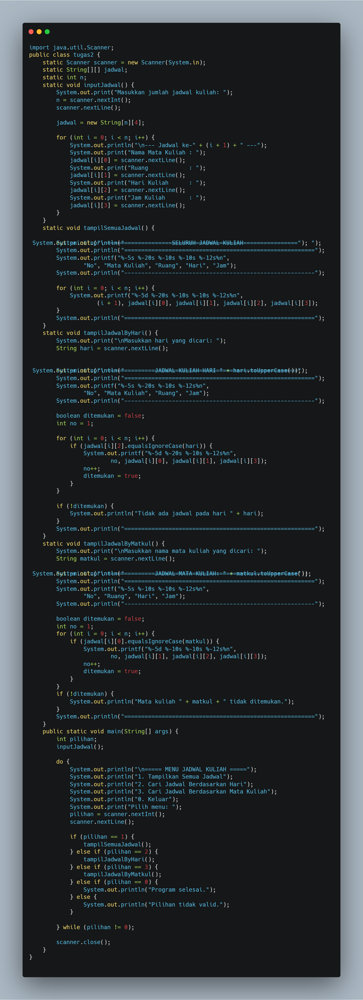

# Laporan Praktikum Algortma St Jobsheet 5 Pemilihan

<h4>Nama : Rafi Priya Nugraha<h4>
<h4>NIM : 254107020120<h4>
<h4>Kelas : TI-1E<h4>

## 1.1 Percobaan 1: Pemilihan
Hasil code
 

## Percobaan 2: Perulangan
Hasil code
 

## Percobaan 3: Array
Hasil code
   

 ## Percobaan 4: fungsi
Hasil code
   

## Tugas 1 
Berikut adalah kodenya:  
   

## Tugas 2 
Berikut adalah hasil kodenya  

