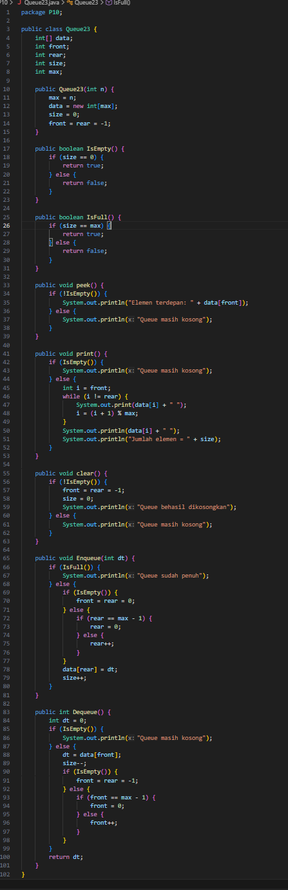

# Laporan Praktikum Algortma Stuktur Data

<h4>Nama : Rafi Priya Nugraha<h4>
<h4>NIM : 254107020120<h4>
<h4>Kelas : TI-1E<h4>

## 12.2 Percobaan 1: Operasi Penambahan pada Double Linked List

Hasil code

### Pertanyaan Percobaan 1

1. Pada konstruktor, mengapa nilai awal atribut front dan rear bernilai -1, sementara atribut size bernilai 0?
2. Pada method Enqueue, jelaskan maksud dan kegunaan dari potongan kode berikut!
   
3. Pada method Dequeue, jelaskan maksud dan kegunaan dari potongan kode berikut!
   
4. Pada method print, mengapa pada proses perulangan variabel i tidak dimulai dari 0 (int i=0), melainkan int i=front?
5. Perhatikan kembali method print, jelaskan maksud dari potongan kode berikut!
   
6. Tunjukkan potongan kode program yang merupakan queue overflow!
7. Pada saat terjadi queue overflow dan queue underflow, program tersebut tetap dapat berjalan
   dan hanya menampilkan teks informasi. Lakukan modifikasi program sehingga pada saat terjadi
   queue overflow dan queue underflow, program dihentikan!

### Jawaban Percobaan 1

1. - front = rear = -1 digunakan sebagai tanda bahwa queue masih kosong dan belum ada elemen yang menempati indeks array manapun.
   - size digunakan oleh IsEmpty() dan IsFull() sebagai sumber kebenaran tunggal
     tentang isi queue, terpisah dari posisi front/rear.
2. Ketika rear sudah mencapai indeks terakhir array (max - 1), artinya ujung kanan
   array sudah habis. Daripada berhenti, rear di-reset ke 0 sehingga elemen berikutnya
   menempati slot paling awal array yang sudah kosong akibat operasi Dequeue sebelumnya.
3. Ketika elemen terdepan berada di indeks terakhir array (max - 1) dan kemudian
   di-dequeue, pointer front harus melingkar kembali ke indeks 0 agar elemen
   berikutnya (yang berada di indeks 0 akibat circular enqueue) bisa diakses dengan benar.
4. Memulai dari i = 0 akan mencetak slot array yang mungkin sudah kosong atau berisi
   data lama yang sudah di-dequeue, bukan elemen aktual queue.
5. Ini adalah traversal circular menggunakan operator modulo.
6. berikut adalah kode yang merupakan queue Overflow

7. berikut adalah modifikasi untuk menghentikan proses overflow dan underflow

#  Percobaan 2 : Antrian Layanan Akademik

### Pertanyaan Percobaan 2

1. Lakukan modifikasi program dengan menambahkan method baru bernama LihatAkhir pada class
AntrianLayanan yang digunakan untuk mengecek antrian yang berada di posisi belakang. Tambahkan
pula daftar menu 6. Cek Antrian paling belakang pada class LayananAkademikSIAKAD sehingga
method LihatAkhir dapat dipanggil!  

### Jawaban Percobaan 2

### Diagram Class — Antrian KRS (Tugas 2.3)

Mahasiswa

Atribut/Method 
- nim: String
- nama  : String 
- prodi : String
- kelas : String
+ Mahasiswa(nim, nama, prodi, kelas : String)
+ tampilkanData() : void

AntrianKRS

Atribut / Method
- data: Mahasiswa[]
- front        : int
- rear         : int
- size         : int
- max          : int  ← tetap 10
- maxDilayani  : int  ← tetap 30 per DPA
- jumlahDilayani : int
+ AntrianKRS(max : int, maxDilayani : int)
+ isEmpty()  : boolean
+ isFull()   : boolean
+ kosongkanAntrian() : void
+ tambahAntrian(mhs : Mahasiswa) : void
+ panggilAntrian() : void  ← proses 2 mahasiswa terdepan
+ tampilkanSemua() : void
+ tampilkan2Terdepan() : void
+ tampilkanTerakhir() : void
+ getJumlahAntrian() : int
+ getJumlahDilayani() : int
+ getJumlahBelumProses() : int

MainKRS (class utama/driver)

Method
+ main(args : String[]) : void