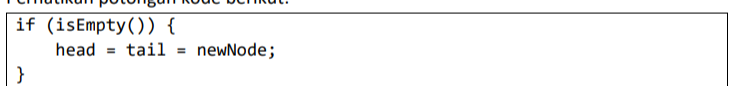
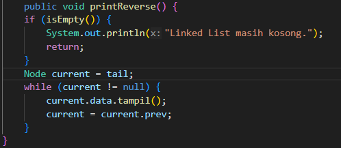

# Laporan Praktikum Algortma St Jobsheet 5 Pemilihan

<h4>Nama : Rafi Priya Nugraha<h4>
<h4>NIM : 254107020120<h4>
<h4>Kelas : TI-1E<h4>

## 12.2 Percobaan 1: Operasi Penambahan pada Double Linked List
Hasil code

### Pertanyaan Percobaan 1
1.  Jelaskan perbedaan struktur dan mekanisme traversal antara Single Linked List dan
Double Linked List!  
2. Perhatikan class Node, di dalamnya terdapat atribut next dan prev. Jelaskan fungsi
masing-masing atribut tersebut pada proses traversal dan manipulasi node!  
3. Perhatikan konstruktor pada class DoubleLinkedList. Jelaskan fungsi konstruktor tersebut terhadap kondisi awal linked list!  
4. Perhatikan potongan kode berikut:  

5. Modifikasi method print() agar menampilkan pesan "Linked List masih kosong" ketika tidak terdapat data pada linked list!  
6. Modifikasi kode program dengan menambahkan method printReverse() untuk menampilkan seluruh data pada Double Linked List secara terbalik, dimulai dari node tail menuju head!  

### Jawaban Percobaan 1
1. - Single Linked List: Hanya memiliki satu buah pointer (umumnya bernama next), sehingga mekanisme penelusuran (traversal) hanya dapat dilakukan dalam satu arah, yakni maju dari head ke tail.
   - Double Linked List: Memiliki dua buah pointer, yaitu next dan prev. Hal ini memungkinkan mekanisme traversal dapat dilakukan dalam dua arah secara dinamis (maju menggunakan next dan mundur menggunakan prev).
2. - Atribut next: Berfungsi sebagai pointer yang menyimpan alamat (referensi) dari node selanjutnya di dalam linked list. Atribut ini memungkinkan penelusuran data secara sekuensial maju  
   - Atribut prev: Berfungsi sebagai pointer yang menunjuk ke node yang mendahuluinya (sebelumnya) di dalam linked list. Atribut ini krusial untuk mencegah node terputus saat manipulasi data dan memungkinkan penelusuran mundur ke arah head. 
3. Konstruktor pada class DoubleLinkedList berfungsi untuk menginisialisasi nilai awal dari variabel pointer head dan tail menjadi null. Kondisi ini mendefinisikan status dasar bahwa pada awalnya linked list tersebut dalam keadaan kosong (tidak memiliki node sama sekali).   
4. Ketika linked list dalam kondisi kosong (isEmpty() bernilai true), kemudian sebuah node baru ditambahkan, maka node tersebut secara otomatis menjadi satu-satunya elemen di dalam list. Karena hanya ada satu node, node tersebut adalah elemen paling depan (head) sekaligus elemen paling belakang (tail) dari keseluruhan list tersebut.  
5. hasil modifikasi dari pertanyaan no 5
  
6. hasil modifikasi dari pertanyaan 6 

# 12.3 Percobaan 2: Operasi Penghapusan pada Double Linked List

### Pertanyaan Percobaan 2
1.  Perhatikan potongan kode berikut pada method removeFirst():
Jelaskan fungsi masing-masing statement tersebut pada proses penghapusan node!

2. Modifikasi method removeFirst() dan removeLast() agar program menampilkan data
yang berhasil dihapus!

### Jawaban Percobaan 2
1. - head = head.next; : Statement ini berfungsi untuk memindahkan pointer head ke node selanjutnya (yaitu node kedua). Dengan pemindahan ini, node kedua secara resmi mengambil alih peran sebagai elemen pertama (awal) dari linked list.  
   - head.prev = null; : Setelah head berpindah ke node kedua, statement ini berfungsi untuk memutus koneksi dari head yang baru ke node pertama yang lama. Dengan mengatur pointer prev menjadi null, node pertama yang lama benar-benar terisolasi dan terlepas dari linked list sehingga bisa dihapus dari memori oleh Garbage Collector.

2. berikut adalah modifikasi untuk soal no 2 

