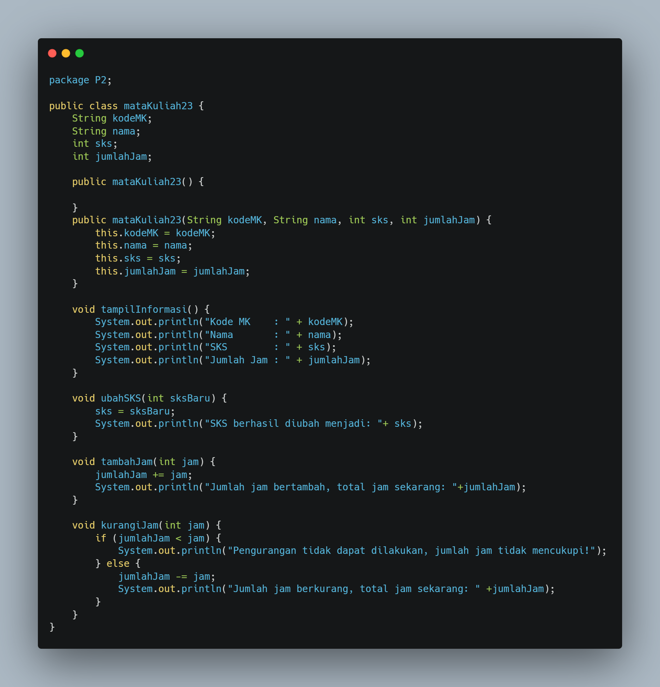
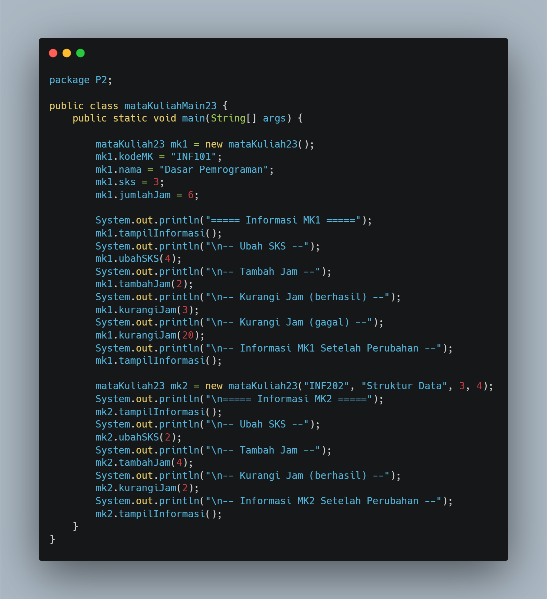
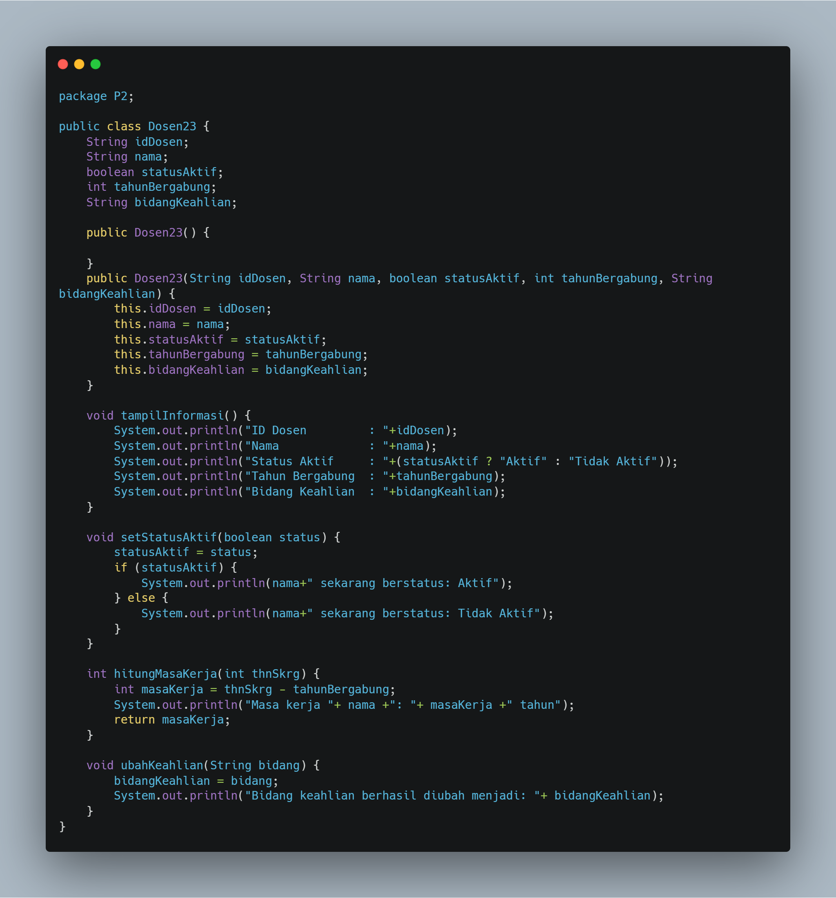
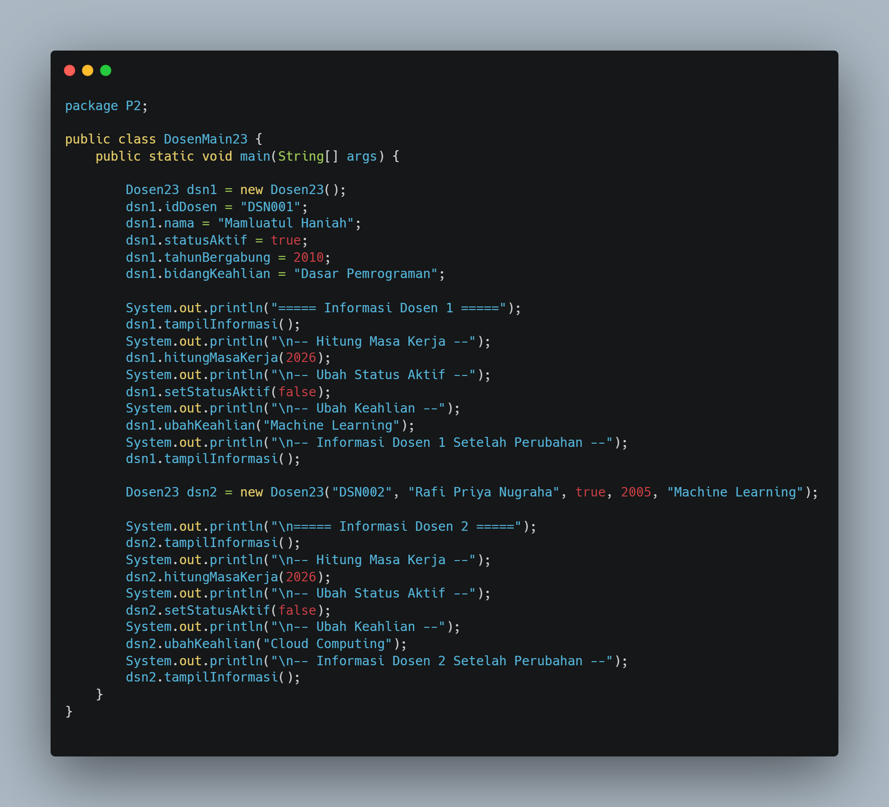

# Laporan Praktikum Algortma St Jobsheet 5 Pemilihan

<h4>Nama : Rafi Priya Nugraha<h4>
<h4>NIM : 254107020120<h4>
<h4>Kelas : TI-1E<h4>

## 2.1 Percobaan 1: Deklarasi Class, Atribut dan Method
Hasil code
 
 

### Pertanyaan Percobaan 1
1. Sebutkan dua karakteristik class atau object!
2. Perhatikan class Mahasiswa pada Praktikum 1 tersebut, ada berapa atribut yang dimiliki oleh class Mahasiswa? Sebutkan apa saja atributnya!
3. Ada berapa method yang dimiliki oleh class tersebut? Sebutkan apa saja methodnya!
4. Commit dan push hasil modifikasi Anda ke Github dengan pesan “Modifikasi Percobaan 1” 

### Jawaban Percobaan 1
1.Setiap class memiliki atribut (data/variabel) dan method (fungsi/perilaku) yang menggambarkan karakteristik dan kemampuan object tersebut.  
2. Pada class mahasiswa memiliki 4 atribut,yaitu nama,nim,kelas,ipk.  
3. Class mahasiswa23 memiliki 4 method, yaitu:  
1 tampilkanInformasi()Menampilkan semua data mahasiswa  
2 ubahKelas()Mengubah kelas mahasiswa  
3 updateIpk()Memperbarui nilai IPK mahasiswa  
4 nilaiKinerja()Mengembalikan status kinerja berdasarkan IPK  
4. Hasil modifikasi

## Percobaan 2.2: Instansiasi Object, serta Mengakses Atribut dan Method

### Pertanyaan Percobaan 2.2
1.Pada class MahasiswaMain, tunjukkan baris kode program yang digunakan untuk proses
instansiasi! Apa nama object yang dihasilkan?  
2. Bagaimana cara mengakses atribut dan method dari suatu objek?  
3. Mengapa hasil output pemanggilan method tampilkanInformasi() pertama dan kedua berbeda?

### Jawaban Percobaan 2.2
1. -Instansiasi Object
     
   -Pemberian Nilai Atribut
        
   -Pemanggilan Method
           
2. Menggunakan dot operator (.) yaitu titik setelah nama object.  
3. Karena di antara pemanggilan pertama dan kedua, terdapat perubahan nilai atribut melalui pemanggilan method ubahKelas() dan updateIpk().  

## Percobaan 3: Membuat Konstruktor
### Pertanyaan Percobaan 3
1.Pada class Mahasiswa di Percobaan 3, tunjukkan baris kode program yang digunakan untuk
mendeklarasikan konstruktor berparameter!  
2.  Perhatikan class MahasiswaMain. Apa sebenarnya yang dilakukan pada baris program
berikut?   
3. Hapus konstruktor default pada class Mahasiswa, kemudian compile dan run program.
Bagaimana hasilnya? Jelaskan mengapa hasilnya demikian!  
4. Setelah melakukan instansiasi object, apakah method di dalam class Mahasiswa harus diakses
secara berurutan? Jelaskan alasannya!   
5.  Buat object baru dengan nama mhs < NamaMahasiswa > menggunakan konstruktor
berparameter dari class Mahasiswa! 
### Jawaban Percobaan 3
1.  
2. Baris kode tersebut melakukan instansiasi object sekaligus inisialisasi atribut menggunakan konstruktor berparameter.  
3. Ketika konstruktor default dihapus, pemanggilan new mahasiswa23() tanpa parameter tidak dikenali oleh Java.  
4. Method dalam sebuah class bersifat independen, artinya masing-masing method berdiri sendiri dan tidak bergantung pada urutan pemanggilan method lain, kecuali ada ketergantungan logika antar method.  
5.   

## Tugas 1 
Berikut adalah kodenya:  
matakuliah23.java
    
Kode Matakuliahmain23.java: 

## Tugas 2 
Berikut adalah hasil kodenya  
Kode Dosen23.java: 

Kode Dosenmain23.java
  

