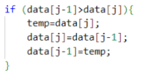

# Laporan Praktikum Algortma St Jobsheet 5 Pemilihan

<h4>Nama : Rafi Priya Nugraha<h4>
<h4>NIM : 254107020120<h4>
<h4>Kelas : TI-1E<h4>

## 5.2. Mengimplementasikan Sorting menggunakan object
Hasil code
 
 
### Pertanyaan Percobaan 1
1.  Jelaskan fungsi kode program berikut  

2. Tunjukkan kode program yang merupakan algoritma pencarian nilai minimum pada
selection sort!
3. Pada Insertion sort , jelaskan maksud dari kondisi pada perulangan  
4. Pada Insertion sort, apakah tujuan dari perintah

### Jawaban Percobaan 1
1. Kode di bawah ini berfungsi untuk melakukan proses swap (pertukaran) nilai dalam array. Pada algoritma Bubble Sort, jika elemen sebelumnya (data[j-1]) bernilai lebih besar dari elemen saat ini (data[j]), maka posisi keduanya ditukar menggunakan variabel bantuan temp agar elemen yang lebih besar bergeser ke kanan (mengurutkan secara Ascending).
2. 
3. Perulangan while ini berfungsi untuk terus menggeser nilai di dalam array ke kanan selama indeks j belum melebihi batas bawah array (>= 0) dan elemen pada data[j] lebih besar dari nilai temp yang sedang disisipkan. Tujuannya adalah mencari posisi sisip yang tepat agar array berurut secara Ascending.  
4. Tujuannya adalah untuk menggeser elemen yang bernilai lebih besar dari temp ke sebelah kanan (indeks j+1) agar tersedia ruang atau indeks kosong untuk memasukkan nilai temp ke posisi yang benar pada akhir iterasi.
## 5.3 Praktikum 2- (Sorting Menggunakan Array of Object)

### Pertanyaan Percobaan 5.3
1. Perhatikan perulangan di dalam bubbleSort() di bawah ini:  

 - Mengapa syarat dari perulangan i adalah i<listMhs.length-1 ?
 - Mengapa syarat dari perulangan j adalah j<listMhs.length-i ?
 - Jika banyak data di dalam listMhs adalah 50, maka berapakali perulangan i akan
berlangsung? Dan ada berapa Tahap bubble sort yang ditempuh?
2. Modifikasi program diatas dimana data mahasiswa bersifat dinamis (input dari keyborad)
yang terdiri dari nim, nama, kelas, dan ipk! 
### Jawaban Percobaan 5.3
1. - Karena pada perulangan luar (yang mengatur iterasi tahap sorting), kita hanya memerlukan total $n-1$ kali tahap perbandingan. Jika terdapat n elemen dan n-1 elemen sudah diurutkan, maka 1 elemen sisa sudah pasti berada pada posisi akhir yang benar.  
   - Karena setiap kali satu tahap iterasi i selesai, 1 elemen dengan nilai terujung (terbesar/terkecil) akan menempati posisi yang benar di akhir array. Oleh karena itu, kita tidak perlu membandingkan ulang elemen yang sudah berada di posisi akhirnya.
   - Perulangan i akan berlangsung sebanyak 49 kali (karena indeks berjalan dari 0 hingga 48). Oleh karena itu, tahap bubble sort yang ditempuh adalah 49 tahap.
2. Hasil kode
 

 ### Pertanyaan Percobaan 5.3.7
 1.
 
  ### Jawaban Percobaan 5.3.7
  1. Proses atau potongan kode tersebut digunakan untuk mencari indeks (idxMin) dari elemen dengan nilai (IPK) terkecil pada sisa data array yang belum terurut.

### Pertanyaan Percobaan 5.4.3
1. Proses atau potongan kode tersebut digunakan untuk mencari indeks (idxMin) dari elemen dengan nilai (IPK) terkecil pada sisa data array yang belum terurut.