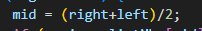
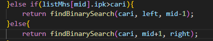

# Laporan Praktikum Algortma St Jobsheet 5 Pemilihan

<h4>Nama : Rafi Priya Nugraha<h4>
<h4>NIM : 254107020120<h4>
<h4>Kelas : TI-1E<h4>

## 6.2. Searching/ Pencarian Menggunakan Algoritma Sequential Search
Hasil code

### Pertanyaan Percobaan 1
1.  Jelaskan perbedaan metod tampilDataSearch dan tampilPosisi pada class
MahasiswaBerprestasi!  
2. Jelaskan fungsi break pada kode program di bawah ini!  

3. Apa fungsi variabel pos atau indeks hasil pencarian dalam program sequential search?  
4. Jika terdapat lebih dari satu data dengan nilai yang sama, hasil pencarian sequential search yang
dibuat di atas akan menampilkan data ke berapa? Jelaskan. 
5. Berkaitan dengan pertanyaan nomor 2 di atas, apa yang terjadi jika perintah break dihapus dari
kode di atas? 

### Jawaban Percobaan 1
1. method tampildatasearch digunakan untuk menampilkan data yang disearch,sedangkan method tampilPosisi digunakan untuk menampilkan pada indeks mana data berada. 
2. break digunakan untuk keluar dari loop ketika data ditemukan,tanpa melanjutkan loop selanjutnya.  
3. digunakan sebagai penanda lokasi indeks dimana data yang dicari ditemukan di array.  
4. data yang pertama kali ditemukan ditampilkan,dikarenakan pada kode terdapat break; maka loop tidak akan dilanjutkan.
5. akan terjadi infinite loop

## 6.3. Searching/ Pencarian Menggunakan Algoritma Binary Search
  

### Pertanyaan Percobaan 6.3
1. Tunjukkan pada kode program yang mana proses divide dijalankan!
2. Tunjukkan pada kode program yang mana proses conquer dijalankan!  
3. Apa fungsi left, right, dan mid?  
4. Jika data IPK yang dimasukkan tidak urut. Apakah program masih dapat berjalan Mengapa demikian?
5. Jika IPK yang dimasukkan dari IPK terbesar ke terkecil (misal: 3.8, 3.7, 3.5, 3.4, 3.2) dan elemen
yang dicari adalah 3.2. Bagaimana hasil dari binary search? Apakah sesuai? Jika tidak sesuai maka
ubahlah kode program binary seach agar hasilnya sesuai  
6. Jelaskan bagaimana binary search menentukan bahwa data yang dicari tidak ditemukan di dalam
array
7. Modifikasi program di atas yang mana jumlah mahasiswa yang diinputkan sesuai dengan masukan
dari keyboard.

### Jawaban Percobaan 6.3
1.     

2. 
3. - left: Menyimpan letak indeks batas awal/kiri dari rentang pencarian pada array.
   - right: Menyimpan letak indeks batas akhir/kanan dari rentang pencarian pada array
   - mid: Menyimpan letak indeks tengah di antara left dan right yang menjadi titik pembagi array, sekaligus lokasi acuan pertama untuk mengecek apakah data sesuai dengan yang dicari.
4. Program masih bisa dikompilasi dan berjalan tanpa error sistem, tetapi hasil pencariannya (output) akan salah atau tidak valid. Konsep Binary Search mewajibkan datanya terurut agar logika perbandingan nilai (< atau >) saat menentukan akan bergeser ke sisi kiri atau sisi kanan bisa bekerja dengan benar. Jika data acak, program bisa saja berbelok ke rentang array yang tidak berisi data yang dituju.
5. Hasilnya tidak sesuai karena struktur kode pada jobsheet didesain khusus untuk urutan naik/ascending (mengecek jika indeks tengah lebih besar dari pencarian, maka pindah ke kiri).
6. Data ditentukan tidak ada apabila perulangan pengecekan rentang sudah habis bergeser, yang ditandai dengan nilai left sudah melebihi nilai right (rentang batas saling tumpang tindih).

## Percobaan 3: Membuat Konstruktor
### Pertanyaan Percobaan 3
1.Pada class Mahasiswa di Percobaan 3, tunjukkan baris kode program yang digunakan untuk
mendeklarasikan konstruktor berparameter!  
2.  Perhatikan class MahasiswaMain. Apa sebenarnya yang dilakukan pada baris program
berikut?   
3. Hapus konstruktor default pada class Mahasiswa, kemudian compile dan run program.
Bagaimana hasilnya? Jelaskan mengapa hasilnya demikian!  
4. Setelah melakukan instansiasi object, apakah method di dalam class Mahasiswa harus diakses
secara berurutan? Jelaskan alasannya!   
5.  Buat object baru dengan nama mhs < NamaMahasiswa > menggunakan konstruktor
berparameter dari class Mahasiswa! 
### Jawaban Percobaan 3
1.  
2. Baris kode tersebut melakukan instansiasi object sekaligus inisialisasi atribut menggunakan konstruktor berparameter.  
3. Ketika konstruktor default dihapus, pemanggilan new mahasiswa23() tanpa parameter tidak dikenali oleh Java.  
4. Method dalam sebuah class bersifat independen, artinya masing-masing method berdiri sendiri dan tidak bergantung pada urutan pemanggilan method lain, kecuali ada ketergantungan logika antar method.  
5.   

## Tugas 1 
Berikut adalah kodenya:  
matakuliah23.java
    
Kode Matakuliahmain23.java: 

## Tugas 2 
Berikut adalah hasil kodenya  
Kode Dosen23.java: 

Kode Dosenmain23.java
  

