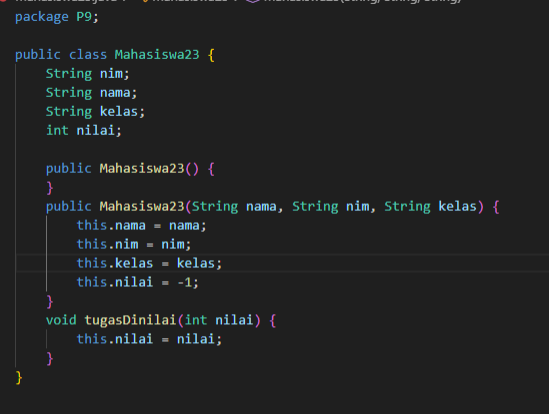

# Laporan Praktikum Algortma Struktur Data

<h4>Nama : Rafi Priya Nugraha<h4>
<h4>NIM : 254107020120<h4>
<h4>Kelas : TI-1E<h4>

### Percobaan 1: Mahasiswa Mengumpulkan Tugas
Hasil code  

### Pertanyaan Percobaan 1
1.  Lakukan perbaikan pada kode program, sehingga keluaran yang dihasilkan sama dengan verifikasi  
hasil percobaan! Bagian mana yang perlu diperbaiki?  
2. Berapa banyak data tugas mahasiswa yang dapat ditampung di dalam Stack? Tunjukkan potongan
kode programnya!  
3. Mengapa perlu pengecekan kondisi !isFull() pada method push? Kalau kondisi if-else tersebut
dihapus, apa dampaknya?  
4. Modifikasi kode program pada class MahasiswaDemo dan StackTugasMahasiswa sehingga
pengguna juga dapat melihat mahasiswa yang pertama kali mengumpulkan tugas melalui operasi
lihat tugas terbawah  
5. Tambahkan method untuk dapat menghitung berapa banyak tugas yang sudah dikumpulkan saat
ini, serta tambahkan operasi menunya!

### Jawaban Percobaan 1
1. berikuta dalah perbaikan kode agar sesuai dengan perilaku LIFO (Last In First Out) 

2. Berikut adalah potongan kode yang menunjukan bahwa stack dapat menampung 5 tugas

3. metode !isFull diperlukan sebagai pengecekan agar ketika stack sudah penuh tidak menyebabkan ArrayIndexOutOfBounds  
4. 
  
5. 

## Percobaan 2: Konversi Nilai Tugas ke Biner
Hasil Kode  

### Pertanyaan Percobaan 2
1. Jelaskan alur kerja dari method konversiDesimalKeBiner!  
2. Pada method konversiDesimalKeBiner, ubah kondisi perulangan menjadi while (kode != 0),
bagaimana hasilnya? Jelaskan alasannya   
### Jawaban Percobaan 2
1. stack akan mencari sisa bagi nilai %2,(1)jika ganjil atau (0) jika Genap,inilah yang akjan menjadi digit biner,lalu menyimnpan stack push:sisa bagi tersebut dimasukkan ke dalam stack, lalau nilai dibagi 2 untuk iterasi selanjutnya 
2. Tidak ada perbedaan output karena kedua kondisi berhenti di titik yang sama
(ketika nilai mencapai 0 melalui pembagian integer berurutan).
